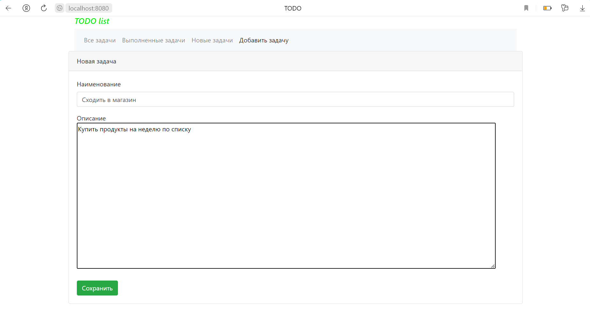
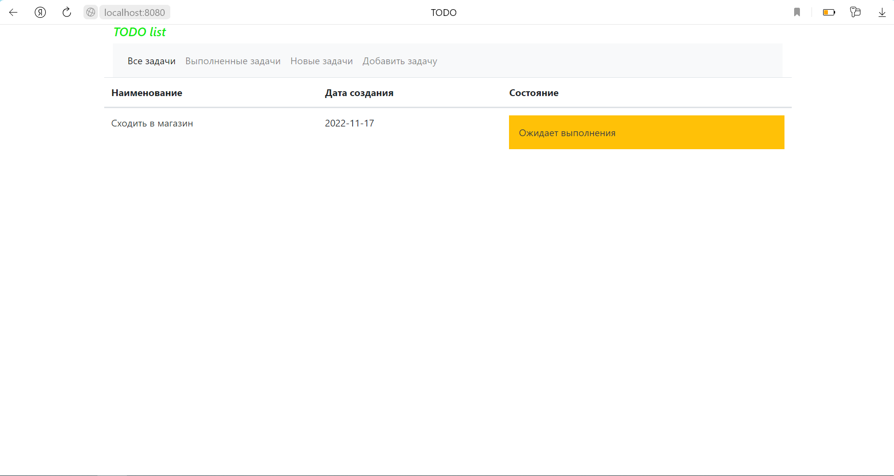
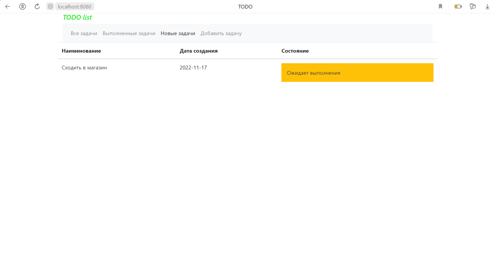
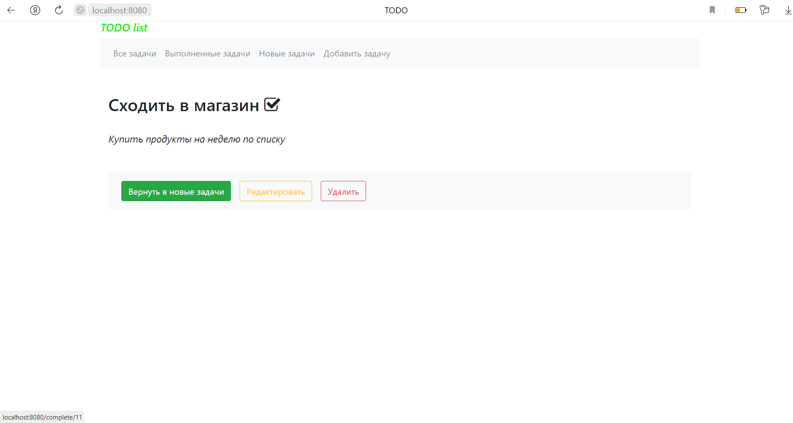
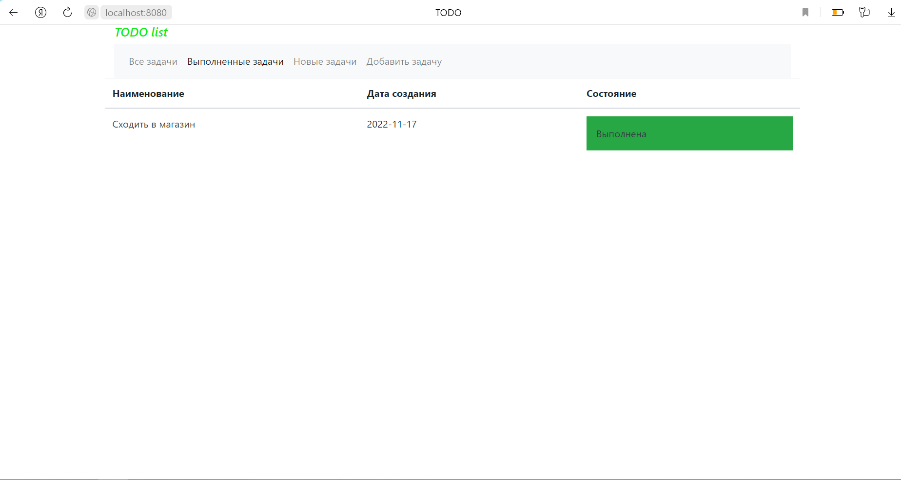
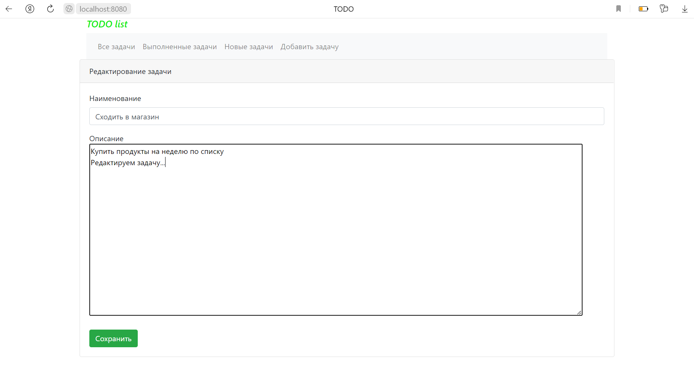
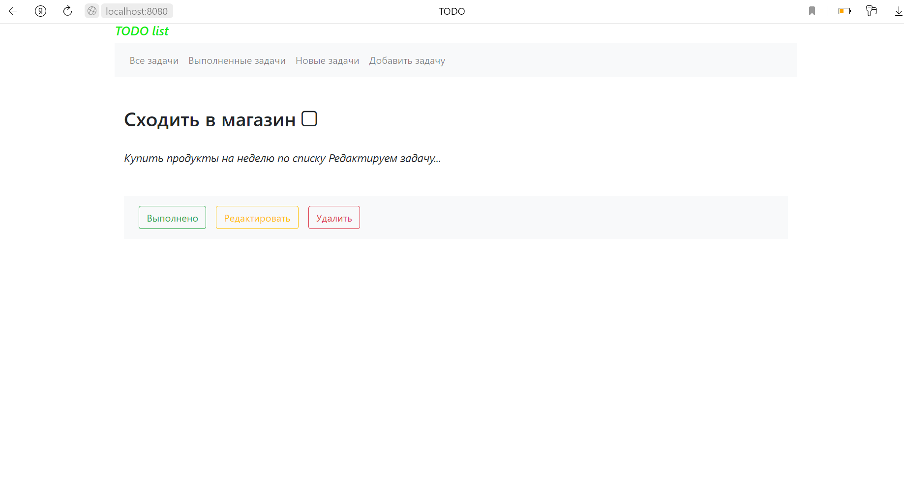
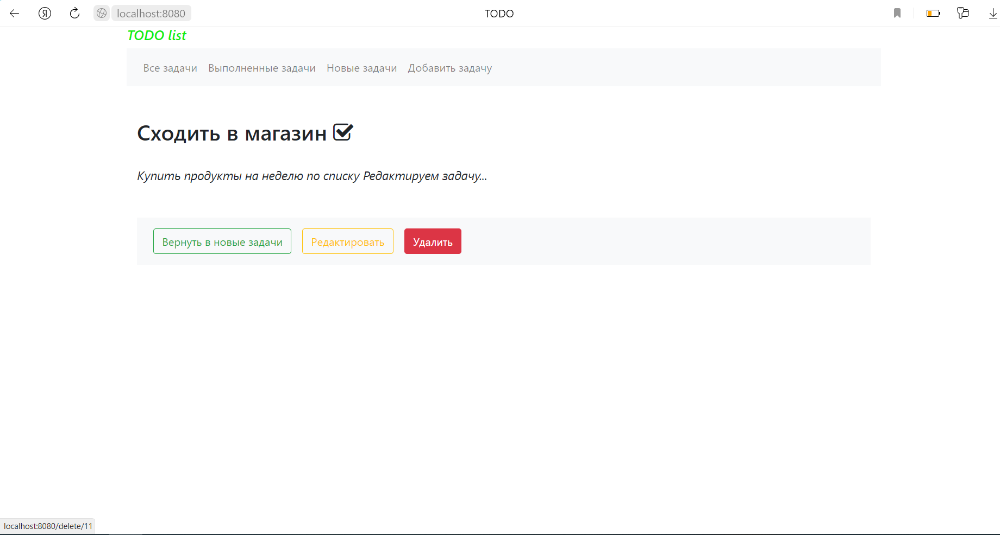
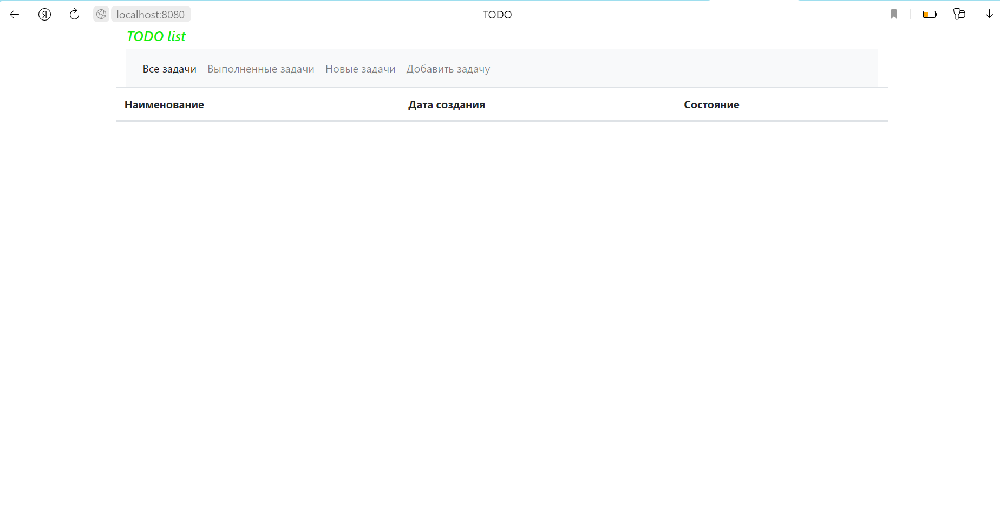

job4j_todo
===========

## Описание
В данном проекте создали приложение "TODO list". Суть приложения в том, что после загрузки главной страницы для нас отображается список задач.
Мы видим имя задачи, дату создания и статус - выполнена она или нет. Нам доступны вкладки для переключения - 
только выполненные задачи, только новые, а также функция добавления новой задачи. Если мы кликнем по конкретной задаче,
то перейдем на страницу её подробного описания. С этой странице мы можем удалить задачу, отредактировать её,
а также изменить её статус.

## Используемые технологии:
- JDK17
- Spring Boot 2.7.3
- Maven 3.8.1
- Hibernate 5.6.11.Final
- PostgreSQL 13.3
- Liquibase 4.15.0
- Bootstrap 4.4.1
- Thymeleaf 3.0.15


## Требуемое окружение:
- JDK17
- Maven 3.8.1
- PostgreSQL 13.3
- Браузер

## Запуск проекта:
- Создать БД todo
  ```jdbc:postgresql://127.0.0.1:5432/todo```
- Собрать jar файл с помощью команды
  ```mvn install```
- Запустить приложение с помощью собранного jar-файла, выполнив команду
  ```java -jar target/job4j_todo-1.0.jar```
- Перейти по ссылке
  ```http://localhost:8080/allTasks```

## Страницы проекта:

### Форма добавления задачи


### Добавленная задача отображается в списке задач


### Список новых задач


### Переход на подробное описание задачи, отмечаем задачу выполненной


### Задача отображается в списке выполненных задач


### Форма редактирования задачи


### Внесённые изменения теперь отображаются в подробном описании


### Удаляем задачу


### Список пуст


## Контактная информация:
free_person@inbox.ru
Ершов Олег