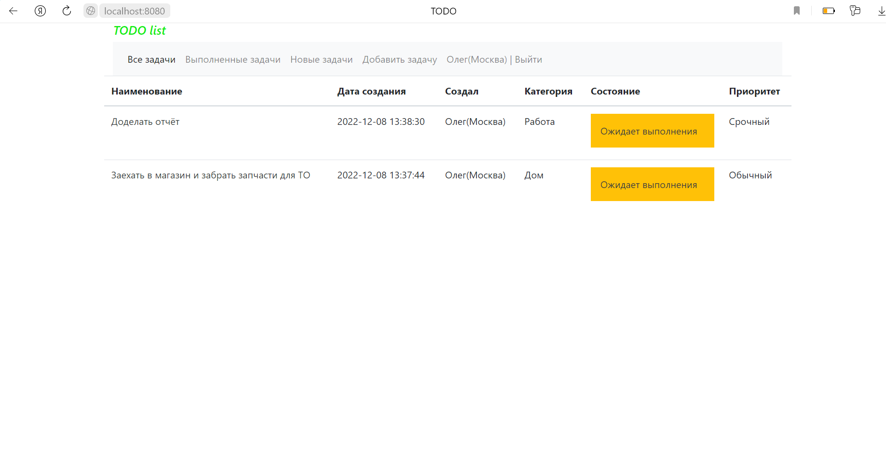

job4j_todo
===========

## Описание
В данном проекте создали приложение "TODO list". Суть приложения в том, что после загрузки главной страницы для нас отображается список задач.
Мы видим имя задачи, дату и время создания, статус - выполнена она или нет, имя пользователя, создавшего её, приоритет и категории, к которым она относится.
Время создания отображается для каждого пользователя с учётом его часового пояса. Нам доступны вкладки для переключения - только выполненные задачи, 
только новые, а также функция добавления новой задачи. Если мы кликнем по конкретной задаче, то перейдем на страницу её подробного описания. 
С этой страницы мы можем удалить задачу, отредактировать её, а также изменить её статус.

## Используемые технологии:
- JDK17
- Spring Boot 2.7.3
- Maven 3.8.1
- Hibernate 5.6.11.Final
- PostgreSQL 13.3
- Liquibase 4.15.0
- Bootstrap 4.4.1
- Thymeleaf 3.0.15


## Требуемое окружение:
- JDK17
- Maven 3.8.1
- PostgreSQL 13.3
- Браузер

## Запуск проекта:
- Создать БД todo
  ```jdbc:postgresql://127.0.0.1:5432/todo```
- Собрать jar файл с помощью команды
  ```mvn install```
- Запустить приложение с помощью собранного jar-файла, выполнив команду
  ```java -jar target/job4j_todo-1.0.jar```
- Перейти по ссылке
  ```http://localhost:8080/tasks/```

## Страницы проекта:

### Для работы в приложении необходимо авторизоваться, поэтому после запуска нас сразу перенаправляет на страницу авторизации(ниже пример использования уже зарегистрированной электронной почты)


### После успешной регистрации перенаправляемся на страницу авторизации, либо переходим сразу, если уже зарегистрированы


### Список всех задач, также можем переключиться на вкладки с только выполненными или только новыми задачами


### Переход на подробное описание задачи по клику на наименование задачи. С этой страницы мы можем отредактировать, удалить или отметить задачу выполненной/новой(в зависимости от текущего статуса)


### Форма редактирования(аналогична форме добавления новой задачи)


### Авторизуемся под другим пользователем и видим, что время создания тех же задач меняется согласно часовому поясу


## Контактная информация:
free_person@inbox.ru
Ершов Олег